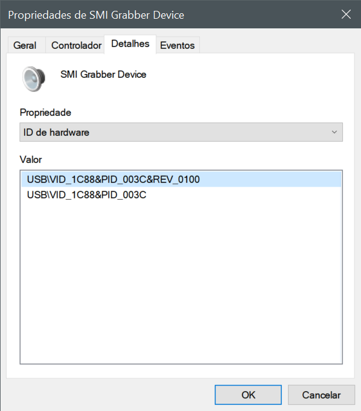
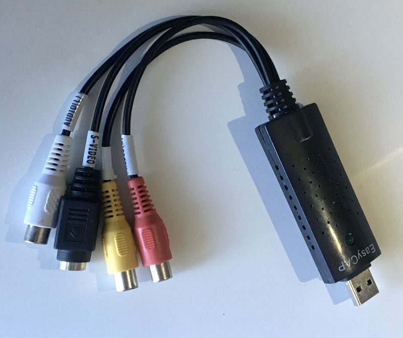
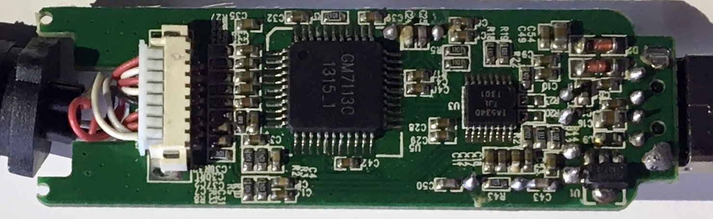
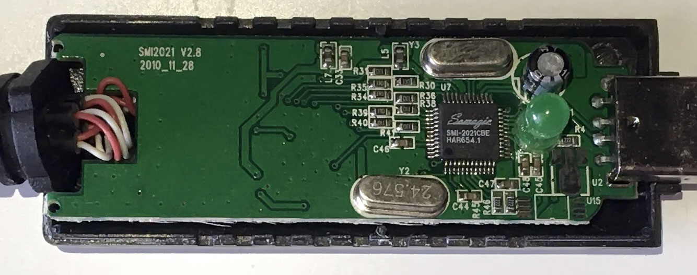

# EasyCap SM USB 007 External Analog Video Capture Card Windows 10 x64 Drivers


## Instructions

1. Make sure that you have the correct device compare with the photos below.
2. Open Windows Device Manager and check for unknown devices (something like: `SM-USB 007`)
3. Right-click on the device to show properties and on the details tab, go the Hardware ID section. Check if your hardware ID is:
```
  USB\VID_1C88&PID_003C&REV_0100
  USB\VID_1C88&PID_003C
```


4. Alternatively, you can use the following PowerShell command:
 ```
  Get-PnpDevice -PresentOnly -Status ERROR,DEGRADED,UNKNOWN
 ```
5. If your device matches, you can try to install these drivers. But first, make a Windows System Restore Point.
6. Clone or download this repository and Unzip the [file](EasyCap-SM-USB-007-Windows-10-x64-drivers.zip)
7. Right-click on the `SmiUsbGrabber3C.inf` file and choose Install
8. On Windows Device Manager you should have now a new device under the Sound Controllers named `SMI Grabber Device`


### Driver Details:
- Date: 26/01/2018
- Version: 1.0.8.28
- Signed by: Somagic (Hangzhou Technology Co. Ltd)


## Personal Notes:
- VirusTotal check: https://www.virustotal.com/gui/file/729403b5f4e38375bb556e5bd9b97b94ed74e6cd5a56eae9038c69035b1961bc/detection

- I had a lot of problems finding a "safe" driver to my Windows Pro x64 machine including a nefarious BSOD each time I plugged the USB device.

- Try to use a USB 3.0 port (to make sure that you have enough current to power the device and the maximum bandwidth). Also, when capturing video try to disconnect any adjacent USB devices near to prevent interferences.

- If you want to buy a similar EasyCap device, I strongly recommend finding another better alternatives. It's a low-cost device with poor capabilities and the audio hardware it's almost unusable 

- To capture video, use [VirtualDub](https://sourceforge.net/projects/virtualdub/files/virtualdub-win/1.10.4.35491/) , and make sure that you select the correct input source







```
Board details:
SMI2021 V2.8
2010_11_28
```